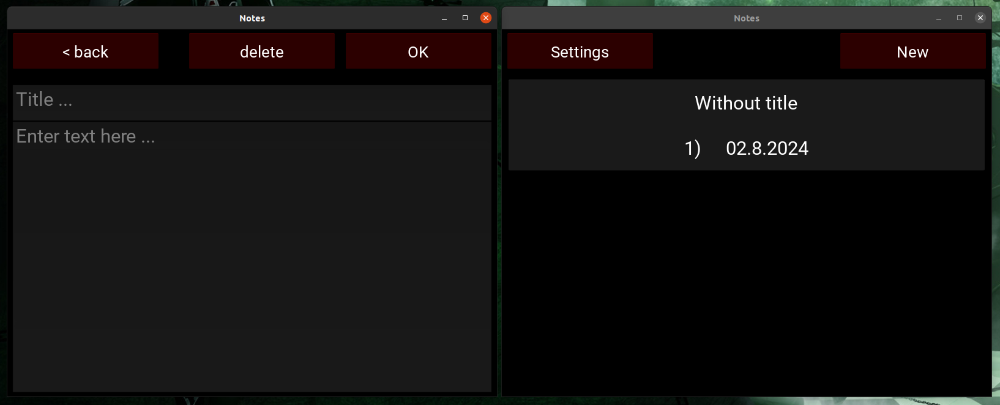

# NOTES



## 🤨 Навіщо ?:
ну... блокнотів завжди мало під рукою. вірніше вони є, але коли треба щось записати - УВЫ нічого нема під рукою

## 🤓 Опис:
блокнот. "але це товар не простий, а європейський, такий із руками й ногами відберуть".
фічі:
- біла і чорна тема
- можна поставити пароль для входу

## ☠️ Використані технології:
- все написано на PYTHON
- GUI на KIVY

## 🌱 Структура проекта:
- `screenshots/` — папка із скріншотами (непотрібна для роботи програми)
- `text_files/` — тут, собствінно і зберігаються файли
- `main.py` — ВЕСЬ код програми, його треба запускати (більше нема варіантів)

## 😎 як запустити ?:
1. встановлюємо необхідні пакети
```bash
sudo apt update
sudo apt install python3
sudo apt install python3-pip python3-dev libsdl2-dev libsdl2-image-dev libsdl2-mixer-dev libsdl2-ttf-dev libportmidi-dev libswscale-dev libavformat-dev libavcodec-dev zlib1g-dev libgstreamer1.0-0 gstreamer1.0-plugins-base gstreamer1.0-plugins-good
pip install "kivy[base]"
```
2. запускаємо програму
```bash
python3 main.py
```

⚠️ ПОПЕРЕДЖЕННЯ:
- не зберігайте в ньому важливі дані
- тут весь код в одному файлі монолітом, І ЦЕ СТАЛО ТИМ ПРОЕКТОМ ПІСЛЯ ЯКОГО Я ПОЧАВ ПИСАТИ МОДУЛЬНУ АРХІТЕКТУРУ (пробуйте продебажити і зрозумієте)

## ❓ Швидкі питання і відповіді
1. "чел, та питань нема" - "супер, я знав що вам сподобається"
